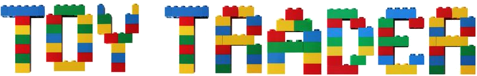

## Overview

Toys are a necessity for children, but children usually get bored with their toys very quickly. They often need different toys to keep them fresh. And those toys that get tired of them in large numbers can cause scrap problems and unnecessary economical to consumers Difficulties. Toy Trader aims to solve these problems by providing a platform that connects individuals who wish to trade toys they no longer use with others and receive new (to the individual) toys in return.

## Features

- Authenticated Login
- Search toys
- Filter toys with categories such as age range, gender, type of toy
- Reporting system to handle dishonest users
- In app messaging to connect with other users

## Tech Stack

-  IDE - Android Studio
-  SDK - Flutter Multiplatform Framework
-  Language - Dart
-  Backend - Google Firebase

## Prototype Images
 

## Testing
...

## Deployment
...

## Developer
...

## Timeline

## Credits

Toy Trader app is being created by students as a Senior Project at California State University - Sacramento. 

